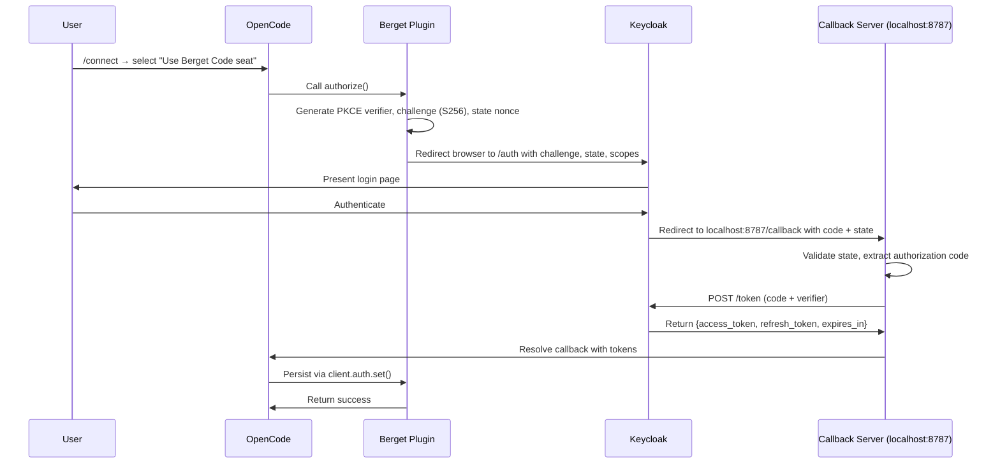
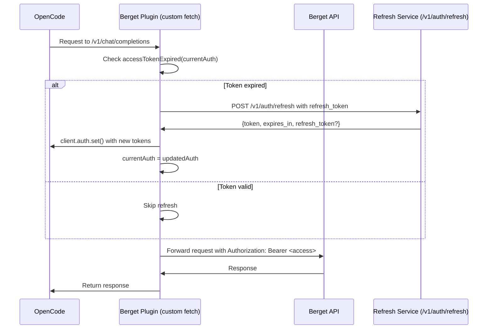
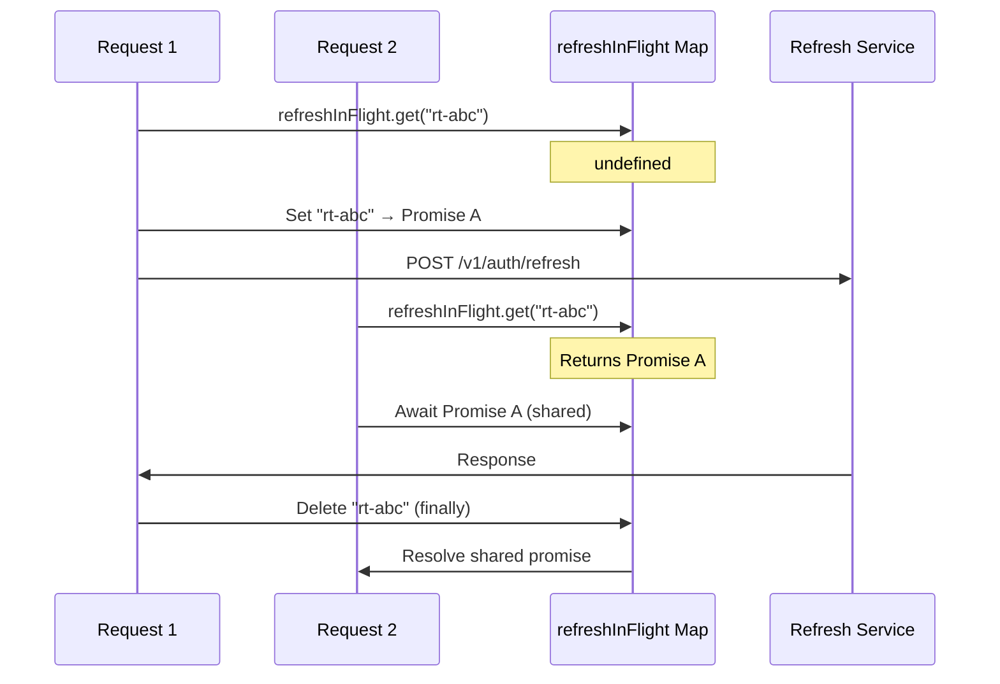

# Authentication Flow

This document describes the complete authentication architecture for the Berget OpenCode Auth Plugin, written for contributors and maintainers.

The plugin implements **dual-authentication support** within the OpenCode plugin framework:

| Method             | Flow                             | Token Lifecycle                | Typical User                         |
| ------------------ | -------------------------------- | ------------------------------ | ------------------------------------ |
| **OAuth 2.0 PKCE** | Browser-based login via Keycloak | Automatic refresh indefinitely | Team members with a Berget Code seat |
| **API Key**        | Paste key manually               | Static, no refresh cycle       | Standalone API key users             |

---

## Table of Contents

- [Token Storage Architecture](#token-storage-architecture)
- [OAuth 2.0 PKCE Login Flow](#oauth-20-pkce-login-flow)
- [Token Refresh Mechanism](#token-refresh-mechanism)
- [Concurrent Session Handling](#concurrent-session-handling)
- [API Key Authentication](#api-key-authentication)
- [Error Handling & Resilience](#error-handling--resilience)
- [Configuration & Environment](#configuration--environment)

---

## Token Storage Architecture

Tokens are stored in **two layers** with distinct purposes:

### 1. Persistent Storage (OpenCode)

When a user completes login or a token is refreshed, the plugin calls:

```typescript
await client.auth.set({
  path: { id: 'berget' },
  body: {
    type: 'oauth',
    access:   '<access-token>',
    refresh:  '<refresh-token>',
    expires:  <unix-timestamp-ms>,     // RAW expiry — no buffer subtracted
  },
});
```

The `expires` value is stored as the **raw Unix timestamp** (e.g. `Date.now() + expires_in * 1000`) without any safety buffer. The 60-second buffer lives exclusively in `accessTokenExpired()` so there is exactly one place where the "should we refresh?" decision is made.

OpenCode persists this in its **secure credential store** — not in project files, `opencode.json`, or environment variables. On the next OpenCode startup, `getAuth()` returns the stored token set, so the user does not need to re-authenticate.

### 2. In-Memory Reference (Loader Closure)

OpenCode calls the `auth.loader` hook **exactly once** at plugin initialization. The loader receives `getAuth()` and returns a configuration object including `apiKey` and a custom `fetch` function. Because OpenCode caches `apiKey` and never calls `loader` again, the plugin instead closes over a **mutable in-memory reference** inside the returned `fetch` closure:

```typescript
let currentAuth = auth as OAuthAuthDetails;

return {
  apiKey: currentAuth.access || '',
  fetch: async (input, init) => {
    if (accessTokenExpired(currentAuth)) {
      const result = await refreshAccessTokenDirect(currentAuth, client);
      if (result.success) {
        currentAuth = result.auth; // In-place update
      }
    }
    // Inject currentAuth.access into request headers while preserving
    // any headers already present on a Request object or in init.
  },
};
```

This design means:

- `currentAuth` is updated **in-place** after every refresh.
- All subsequent API requests within the same OpenCode process use the fresh token **without restarting**.
- OpenCode's cached `apiKey` (from the initial `loader` return) is stale, but the custom `fetch` always reads from the live `currentAuth` reference.

---

## OAuth 2.0 PKCE Login Flow

The plugin implements RFC 7636 PKCE, adapted for a desktop CLI environment where a local HTTP callback server is feasible.

### Sequence: Initial Login



### Key Implementation Notes

| Step                   | Detail                                                                                                                                                                          |
| ---------------------- | ------------------------------------------------------------------------------------------------------------------------------------------------------------------------------- |
| **Code Verifier**      | 32 random bytes, generated via `crypto.webcrypto.getRandomValues` for forward-compatibility with Node 18+, base64url-encoded. Challenge = SHA-256(verifier), base64url-encoded. |
| **Callback Server**    | Created and destroyed per-login attempt. Listens on `127.0.0.1:8787` (loopback interface only), never on `0.0.0.0`.                                                             |
| **Timeout**            | 5-minute hard timeout; server auto-closes and resolves with failure.                                                                                                            |
| **State Validation**   | Prevents CSRF by comparing the `state` nonce returned in the callback against the one generated in `authorize()`.                                                               |
| **Port Conflict**      | If port 8787 is in use, the server fails immediately with a descriptive error.                                                                                                  |
| **Error Display**      | OAuth error callbacks include both `error` and `error_description` in the HTML page and resolved message.                                                                       |
| **Cache Headers**      | Callback HTML responses include `Cache-Control: no-store, no-cache, must-revalidate, proxy-revalidate` to prevent caching of sensitive one-time codes.                          |
| **Headless Detection** | Detects `SSH_CONNECTION`, `SSH_CLIENT`, `SSH_TTY`, `OPENCODE_HEADLESS`, or `CI` env vars. Still attempts PKCE but warns the user that a browser is required.                    |

---

## Token Refresh Mechanism

The access token has a limited lifetime (returned as `expires_in` from Keycloak). The plugin refreshes it **automatically and transparently** on every API request.

### Sequence: Per-Request Refresh



### Expiry Detection

The `accessTokenExpired()` helper adds a **60-second buffer** (`ACCESS_TOKEN_EXPIRY_BUFFER_MS`) before the actual expiry timestamp:

```typescript
function accessTokenExpired(auth: OAuthAuthDetails): boolean {
  if (!auth.access || typeof auth.expires !== 'number') return true;
  return auth.expires <= Date.now() + 60_000; // 60s headroom
}
```

This prevents edge cases where a token expires _during_ a slow request or between the check and the actual network call.

### Expiry Timing Detail

The stored expiry is the **raw timestamp** (`Date.now() + expires_in * 1000`). The 60-second buffer is applied only when checking via `accessTokenExpired()`:

```typescript
// When saving tokens after login or refresh:
expires = Date.now() + data.expires_in * 1000; // RAW — no buffer subtracted

// When checking at request time:
return auth.expires <= Date.now() + 60_000; // true when <= 60s of raw expiry remains
```

For a 300-second (`5 min`) token:

- **Old behavior (double buffer):** refreshed after ~180s (40% waste).
- **New behavior (single buffer):** refreshed after ~240s (industry-standard 60s buffer).

### Refresh Endpoint

- **Path**: `POST /v1/auth/refresh`
- **Base URL**: Derived from `BERGET_API_URL` (default `https://api.berget.ai`)
- **Request Body**: `{"refresh_token": "<refresh>"}`
- **Response**: `{"token": "<new-access>", "expires_in": 3600, "refresh_token?": "<rotated>"}`

The `refresh_token` in the response is **optional**. If present, the plugin adopts the new refresh token (rotation). If absent, the existing one is preserved.

### Persistence After Refresh

After every successful refresh, the plugin immediately persists the updated tokens:

```typescript
await client.auth.set({
  path: { id: 'berget' },
  body: {
    type: 'oauth',
    access: updatedAuth.access,
    refresh: updatedAuth.refresh,
    expires: updatedAuth.expires,
  },
});
```

**Regression context**: There was a bug where tokens were refreshed in-memory but never persisted, causing users to re-authenticate after every OpenCode restart. The persistence step in `refreshAccessTokenDirect()` is the fix.

---

## Concurrent Session Handling

Multiple API requests can be initiated while the current access token is expired. Without deduplication, each request would independently trigger a token refresh, creating race conditions (especially with refresh token rotation).

### Deduplication Mechanism

The plugin maintains an **in-flight refresh map** at module scope in `token.ts`:

```typescript
const refreshInFlight = new Map<string, Promise<RefreshResult>>();
```

Keyed by the **raw refresh token string**, this map tracks active refresh operations:



### Cross-Process Token Races

Because OpenCode stores credentials on disk through an opaque local server, there are **no guarantees** about atomic writes or file locking when multiple terminals run simultaneously. Two `opencode` processes can interact with the same stored refresh token:

#### Scenario: Another Process Refreshes First

| Timeline | Process A                                  | Process B                    |
| -------- | ------------------------------------------ | ---------------------------- |
| t0       | Token expires, `currentAuth` is stale      | —                            |
| t1       | `refreshAccessTokenDirect()` in flight     | Token also expires           |
| t2       | B refreshes first, persists new token      | `client.auth.set()` succeeds |
| t3       | Refresh request returns `invalid_grant`    | Continues with fresh token   |
| t4       | Detects `invalid_grant`, reloads from disk | —                            |
| t5       | Finds B's persisted token, recovers        | —                            |

The plugin defends against this in **two layers**:

**1. Cache-busting `getAuth()` read before refresh:**

Before initiating an HTTP refresh in the `fetch` wrapper, the plugin asks the framework for the latest auth from disk:

```typescript
if (accessTokenExpired(currentAuth)) {
  const diskAuth = await getAuth();
  if (isOAuthAuth(diskAuth) && !accessTokenExpired(diskAuth)) {
    currentAuth = diskAuth;        // Adopt fresher token
    return fetchWithAuth(...);     // Skip HTTP refresh entirely
  }
  // Still expired — proceed with HTTP refresh
  const result = await refreshAccessTokenDirect(currentAuth, client, getAuth);
}
```

If another process has refreshed and persisted a valid token, the current process **adopts it immediately** without a network round-trip.

**2. `invalid_grant` / `invalid_token` recovery via disk reload:**

If the refresh token has already been consumed by another process, the current process receives `invalid_grant` or `invalid_token` from the refresh endpoint. Before failing:

```typescript
if (errorData?.error === 'invalid_grant' || errorData?.error === 'invalid_token') {
  if (getAuth) {
    try {
      const diskAuth = await getAuth();
      if (isOAuthAuth(diskAuth) && !accessTokenExpired(diskAuth)) {
        logDebug('Recovered from invalid_grant: valid token found on disk');
        return { auth: diskAuth, success: true };
      }
    } catch {
      // Fall through to standard failure
    }
  }
  return { reason: 'Refresh token is invalid or revoked', success: false };
}
```

This recovers gracefully when another process wins the refresh race. The `getAuth()` call is wrapped in `try/catch` to ensure a storage failure is not fatal.

### Login Port Singleton Limitation

The PKCE callback server binds to port `8787` on `127.0.0.1`. Because the port is hard-coded, **only one concurrent login attempt** can run on the same machine:

```
Port 8787 is already in use. Another OpenCode login may be in progress.
Please wait and try again, or close other OpenCode sessions.
```

This is by design — the port must match the `redirect_uri` registered with Keycloak. To log in from a second terminal, the first terminal must either complete or abort its login attempt. The error message explicitly tells the user about the concurrent-login explanation.

---

## API Key Authentication

The simpler path. When the user selects "Use Berget AI API key":

1. OpenCode stores the key in its secure credential store.
2. `getAuth()` returns `{ type: 'api', key: 'sk-...' }`.
3. The plugin's loader detects non-OAuth auth and returns a custom `fetch` that:
   - Normalizes the input into a single `Request` object to capture headers from both `Request` objects and `init`.
   - Injects (or overwrites) the `Authorization: Bearer <key>` header.
   - Passes the normalized `Request` object to the native `fetch` so all original headers are preserved.

No expiry detection, no refresh logic, no callback server. The key is valid until explicitly revoked or rotated by the user.

---

## Error Handling & Resilience

### Transient 5xx Retry

If the refresh endpoint returns a **5xx-class** error (e.g. `503 Service Unavailable`), the retry logic in `token.ts` performs up to **2 retry attempts** with exponential backoff:

| Attempt     | Delay  | Strategy                  |
| ----------- | ------ | ------------------------- |
| 1st failure | 500ms  | Immediate retry.          |
| 2nd failure | 1500ms | One more retry.           |
| 3rd failure | —      | Return failure to caller. |

4xx client errors (e.g. `400`, `401`) are **not retried** — they are deterministic failures.

### Refresh Token Invalid or Revoked

If the server returns **HTTP 400** or **401** with an `invalid_grant` or `invalid_token` error, the plugin:

1. Logs a warning: `[Berget Auth] Refresh token is invalid or revoked. Please run \`opencode auth login\` to reauthenticate.`
2. Returns a `RefreshResult` with `success: false` and a clear `reason`.
3. The caller (the custom `fetch` wrapper) throws an error, surfacing it to the user.

As part of the error recovery, there is **no automatic deletion** of the stored credentials in OpenCode. The stale token set remains on disk and will fail again on the next startup. The user must explicitly run `opencode auth login` to overwrite it with a fresh token pair.

### Network Errors

If the refresh request fails due to DNS, timeout, or connectivity:

1. The error is logged with `console.error`.
2. The refresh returns `success: false` with a `reason` like `"Network error: ..."`.
3. The caller throws, so the user sees the failure rather than proceeding with a stale token.

### Persistence Failures

If `client.auth.set()` fails (e.g. disk full, OpenCode race condition):

```typescript
try {
  await client.auth.set({ ... });
} catch (error) {
  console.warn('[Berget Auth] Failed to persist token refresh:', error);
}
```

- **Non-fatal**: The in-memory `currentAuth` is still updated, so the current session continues.
- **Impact**: On the next OpenCode restart, the old (now expired) token is loaded and a full re-login is required.

### Malformed Token Responses

Both the PKCE login flow (`/token` exchange) and the refresh flow (`/v1/auth/refresh`) validate the JSON body at runtime before destructuring fields:

```typescript
// PKCE token exchange
if (
  typeof tokenData.access_token !== 'string' ||
  typeof tokenData.expires_in !== 'number' ||
  typeof tokenData.refresh_token !== 'string'
) {
  return { type: 'failed', error: 'Invalid token response from authorization server' };
}

// Refresh token exchange
if (typeof data.token !== 'string' || typeof data.expires_in !== 'number') {
  return { success: false, reason: 'Invalid token response from refresh endpoint' };
}
```

This prevents a proxy or WAF from returning a 200 OK with an error body (e.g. `{"error": "rate_limited"}`) from silently corrupting the stored tokens with `undefined` values.

### Defensive Token Validation

Before persisting refreshed tokens, the plugin checks that `access` is truthy and `expires` is a number. If either is missing or malformed, persistence is skipped entirely to avoid overwriting valid stored tokens with garbage.

---

## Configuration & Environment

The plugin derives its endpoints from environment variables at runtime, allowing easy switching between production, staging, and local development without code changes.

| Variable               | Default                    | Purpose                                  |
| ---------------------- | -------------------------- | ---------------------------------------- |
| `BERGET_API_URL`       | `https://api.berget.ai`    | Base URL for API calls and token refresh |
| `BERGET_INFERENCE_URL` | `https://api.berget.ai/v1` | Chat completions endpoint base           |
| `OPENCODE_HEADLESS`    | —                          | Detected to warn about missing browser   |

### Keycloak URL Derivation

The plugin infers which Keycloak instance to use from `BERGET_API_URL`:

- Contains `localhost` or `127.0.0.1` → Staging Keycloak
- Contains `stage` → Staging Keycloak
- Otherwise → Production Keycloak

This keeps the plugin portable across environments without adding a third configuration variable.

---

## Provider ID

The plugin registers itself under the provider ID **`berget`**. This ID is used as:

- The `provider` field in the auth hook.
- The `path.id` in `client.auth.set()` and `client.auth.delete()` calls.
- The key under `config.provider.berget` for model and API configuration.

---

## Summary

The Berget Auth Plugin's authentication architecture is built on a small set of deliberate design choices:

1. **Mutable in-memory reference** in the `loader` closure ensures live token updates without OpenCode restarts.
2. **Persistent storage via `client.auth.set()`** ensures tokens survive process restarts.
3. **Per-request refresh** via a custom `fetch` wrapper makes expiry handling transparent to the user.
4. **Concurrent refresh deduplication** via `refreshInFlight` prevents thundering-herd refresh token consumption.
5. **Graceful degradation** on persistence/network failures prioritizes the current session over long-term storage.
